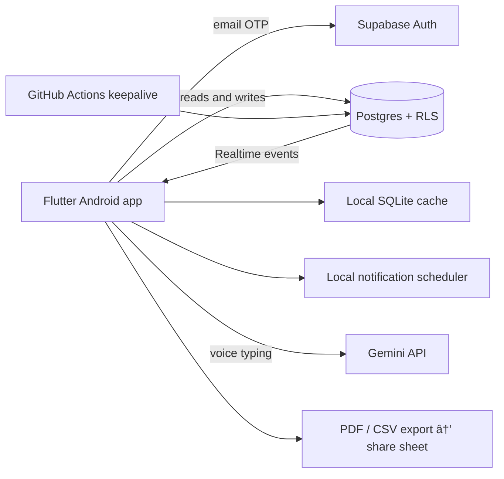

# ATS Field Ops — Android App Showcase

I built and shipped this Android app solo for **Auto Tech Support**, a truck fitment and auto-electrical company in Johannesburg. It runs in daily production use by the field team: job scheduling, materials and tools kits, reminders, and PDF/CSV exports for their invoicing workflow. This repository is a curated showcase. The production repository is private, and every screenshot and video here uses seeded test data because real job records contain customer names.

## Tech stack

| Layer | Choice |
|---|---|
| App | Flutter (Dart), single signed-release APK |
| Auth | Supabase email OTP, invite-only whitelist |
| Database | Supabase Postgres with Row Level Security |
| Sync | Supabase Realtime |
| Offline | Local SQLite cache with offline banner |
| Notifications | Local scheduled notifications (no FCM) |
| Voice input | Gemini API transcription, SHA-1 restricted key |
| Exports | PDF and CSV via system share sheet |
| Ops | GitHub Actions keepalive for the free-tier backend |

## Demo videos

- **Recruiter cut (~90 seconds):** [link]
- **Technical walkthrough:** [link]

Both recorded on device with seeded test data.

## Architecture

## Screenshots

*(Seeded test data only. Consistent device frame, captioned.)*

| | |
|---|---|
| Kits list | Job detail |
| Job scheduler | Export sheet |

## Architecture Decision Records

See [`/adr`](./adr) for the reasoning behind key choices: kit snapshot immutability, the notification ID scheme, Realtime reload strategy, Supabase free tier as the entire backend, release signing discipline, API key restriction, and pinned dependencies.

## Competency mapping

See [`COMPETENCY_MAP.md`](./COMPETENCY_MAP.md) for how this build maps to cloud and IT competencies.

## Rights and permission

Auto Tech Support has given written permission for this app to be presented publicly as a portfolio piece, including use of the company name. All data shown is seeded test data. No customer information, vehicle identifiers, staff names, or business figures appear in this repository or its linked media.

