# ATS Field Ops: Android App Showcase

A small auto-electrical team in Johannesburg was running jobs off memory and paper. Technicians arrived on site missing parts, there was no proof that work had been completed, and the office phoned the owner for every job detail. I designed, built and shipped an Android app solo for **Auto Tech Support** that fixed all three, and it has been in daily production use since June 2026.

[Read the full case study](CASE_STUDY.md)

This repository is a curated showcase. The production repository is private, and every screenshot and video here uses seeded test data because real job records contain customer names.

## Tech stack

| Layer | Choice |
|---|---|
| App | Flutter (Dart), single signed-release APK |
| Auth | Supabase email OTP, invite-only whitelist |
| Database | Supabase Postgres with Row Level Security |
| Sync | Supabase Realtime |
| Offline | Local SQLite cache with offline banner |
| Notifications | Local scheduled notifications (no FCM) |
| Voice input | Gemini API transcription, SHA-1 restricted key |
| Exports | PDF and CSV via system share sheet |
| Ops | GitHub Actions keepalive for the free-tier backend |

## Demo

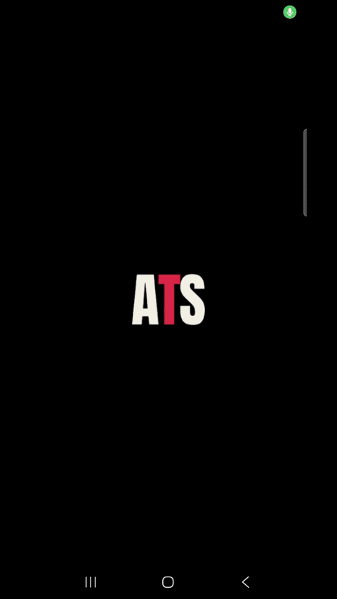

**Full walkthrough (2 minutes):** https://www.youtube.com/watch?v=pTQCMCLtmF4

Recorded on device with seeded test data.

## Architecture

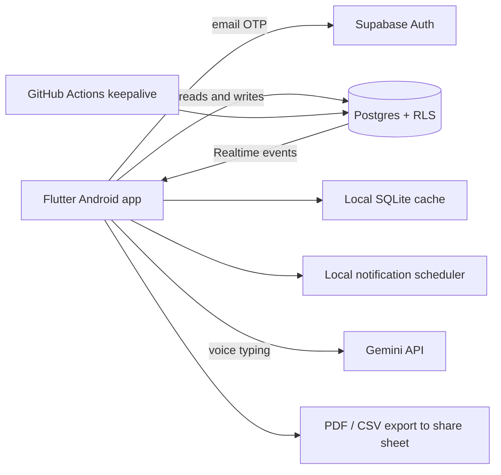

## Screenshots

Seeded test data only.

| | | |
|---|---|---|
| 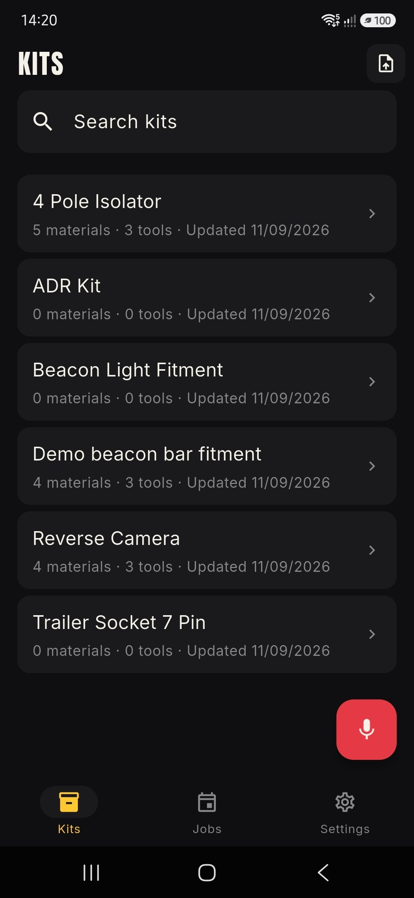 **Kits list** | 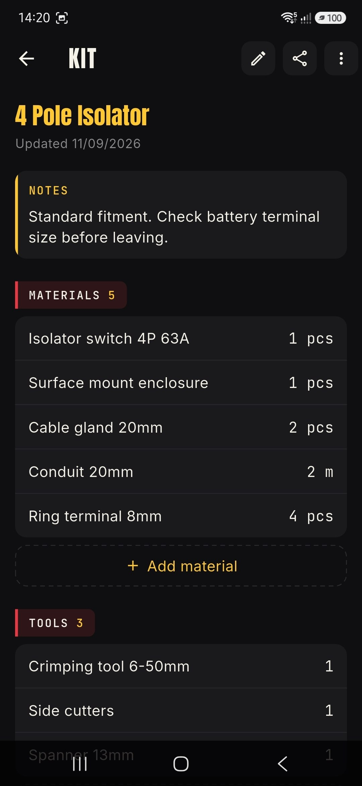 **Kit detail** | 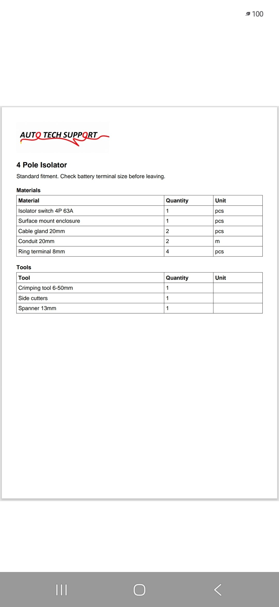 **Exported kit PDF** |
| 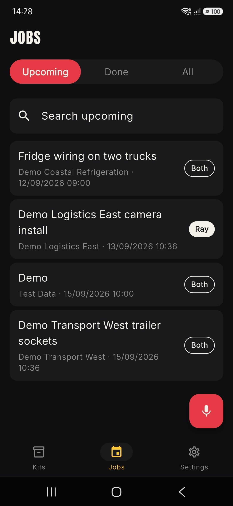 **Jobs list** | 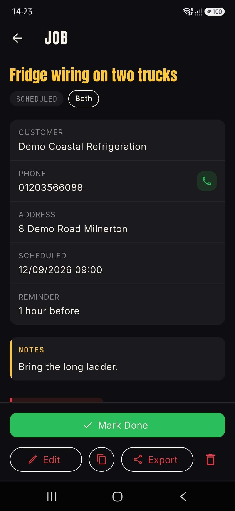 **Job detail** | 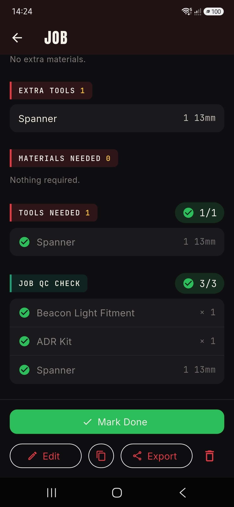 **Materials, tools and checklist** |
| 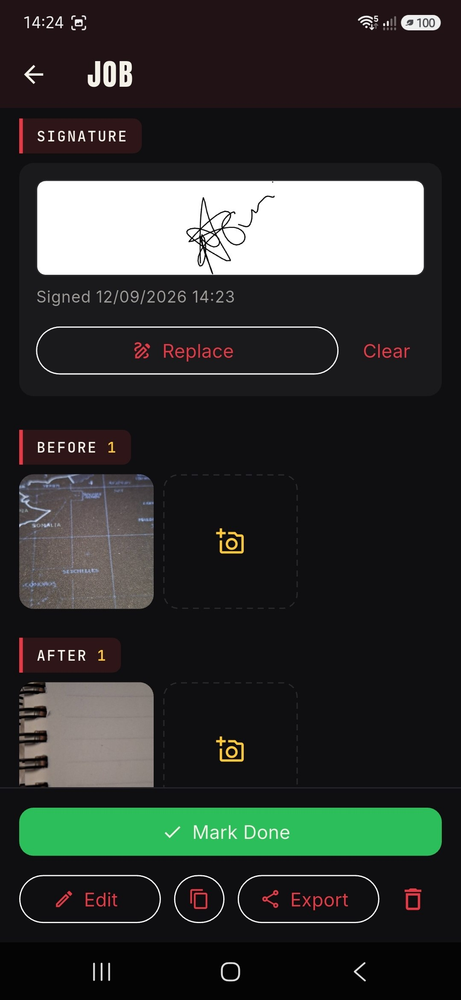 **Photos and signature sign-off** | 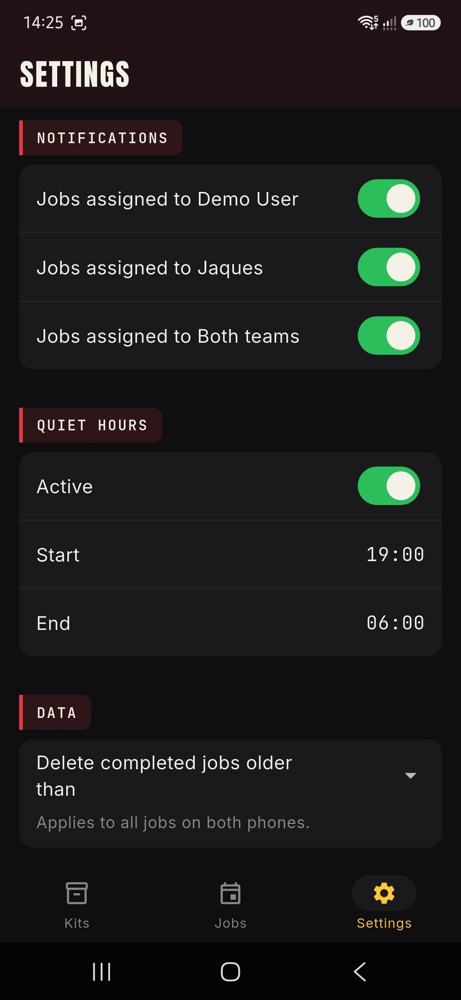 **Notification preferences** | 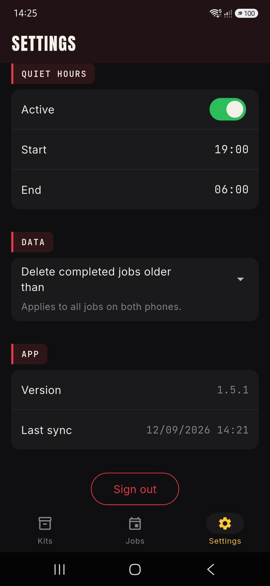 **Quiet hours** |
## Architecture Decision Records

See [`/adr`](./adr) for the reasoning behind key choices: kit snapshot immutability, the notification ID scheme, Realtime reload strategy, Supabase free tier as the entire backend, release signing discipline, API key restriction, and pinned dependencies.

## Competency mapping

See [`COMPETENCY_MAP.md`](./COMPETENCY_MAP.md) for how this build maps to cloud and IT competencies.

## Rights and permission

Auto Tech Support has given written permission for this app to be presented publicly as a portfolio piece, including use of the company name. All data shown is seeded test data. No customer information, vehicle identifiers, or business figures appear in this repository or its linked media. The only name shown is the owner's, used with permission.

## Client feedback

> "Before the app I kept everything in my head and on WhatsApp. When too many clients called in one day, jobs slipped through and I would forget to get back to people. Now every job is logged the moment it comes in, nothing gets lost, and I can see exactly what still needs attention. It has changed how we run the business."

Jaques Scholtz, Owner, Auto Tech Support, Johannesburg
